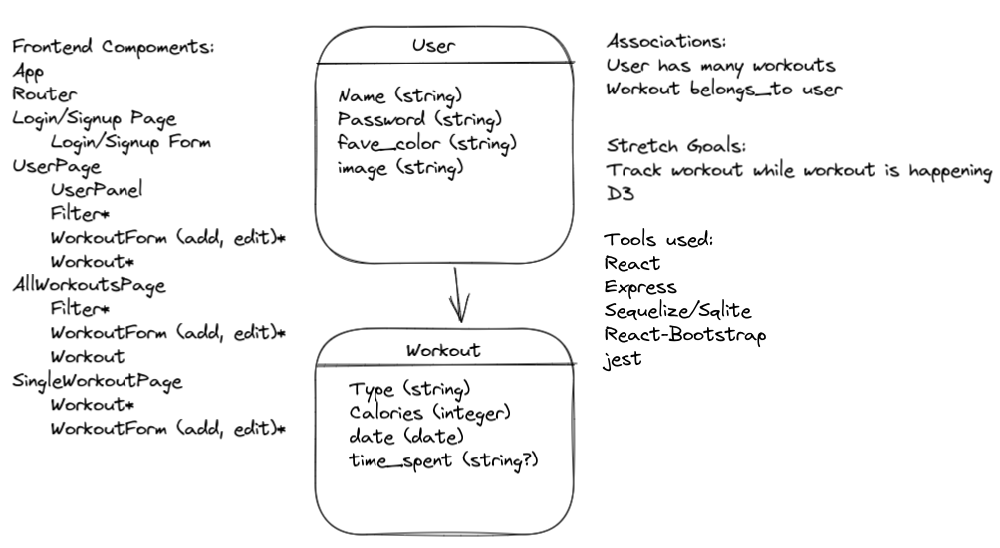
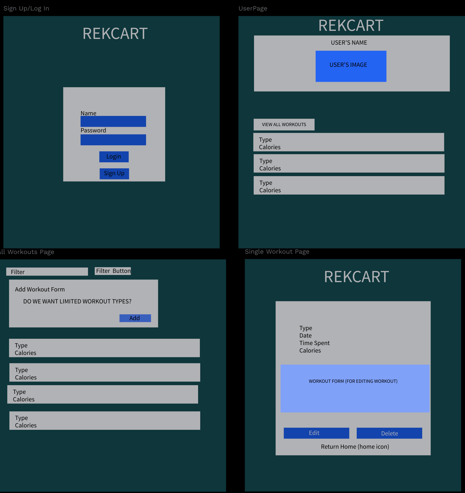

# REKCART

## Description
Sign up and create an account to track all your workouts!

## How to run the application
1. Clone the repository
``` bash
git clone https://github.com/cesarsnina/REKCART.git
```

2. Change into the working 
``` bash
cd ${PATH}/REKCART
```

3. Install dependencies
``` bash
npm i
``` 

4. Run the backend server
``` bash
npm run server
```

5. Run the frontend server
``` bash
npm start
```

6. Go to http://localhost:3000 and sign up as a user!

## Functional Features

- [] User data persists
- [] Data input tracks date and time of workout
- [] Users can filter workouts
- [] Users can delete workouts instances
- [] Users can edit workouts instances
- [] Users can create a profile with at least two personalized settings

## Non-functional Features

- [] The application & server-side validation in place
- [] The application must have evidence of automated unit testing
- [] The application code must be documented in a manner that it would be easy for a new developer to understand
- [] The application code must be stored in a GitHub repository and deployed on Heroku

## Tools and Frameworks
- React
- Express
- Sequelize
- Sqlite
- React Bootstrap
- Moment.js library
- nodemon

## Team Roles & Responsibilities
- [Jazmin Matos](https://github.com/jazminmatos): Workout.js, SingleWorkoutsPage,js, AllWorkoutsPage.js
- [Cesar Nina](https://github.com/cesarsnina): UserPage.js, UserPanel.js, App.js, CSS styling
- [Eric Davenport](https://github.com/EricDavenport): WorkoutForm.js, Jest Testing
- [Danny Reina](https://github.com/dannyreina): Filter.js, Login.js, Signup.js, UserContext.js

## UML Class Diagram


## Design Mockup
